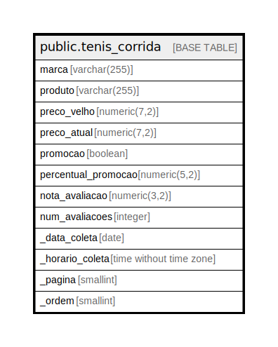

# public.tenis_corrida

## Description

## Columns

| Name | Type | Default | Nullable | Children | Parents | Comment |
| ---- | ---- | ------- | -------- | -------- | ------- | ------- |
| marca | varchar(255) |  | false |  |  |  |
| produto | varchar(255) |  | false |  |  |  |
| preco_velho | numeric(7,2) |  | false |  |  |  |
| preco_atual | numeric(7,2) |  | false |  |  |  |
| promocao | boolean |  | false |  |  |  |
| percentual_promocao | numeric(5,2) |  | false |  |  |  |
| nota_avaliacao | numeric(3,2) |  | false |  |  |  |
| num_avaliacoes | integer |  | false |  |  |  |
| _data_coleta | date |  | false |  |  |  |
| _horario_coleta | time without time zone |  | false |  |  |  |
| _pagina | smallint |  | false |  |  |  |
| _ordem | smallint |  | false |  |  |  |

## Relations

---

> Generated by [tbls](https://github.com/k1LoW/tbls)
