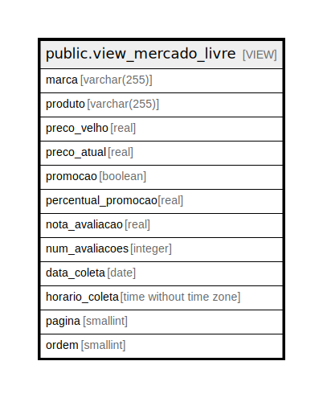

# public.view_mercado_livre

## Description

<details>
<summary><strong>Table Definition</strong></summary>

```sql
CREATE VIEW view_mercado_livre AS (
 SELECT marca,
    produto,
    (preco_velho)::real AS preco_velho,
    (preco_atual)::real AS preco_atual,
    promocao,
    ((percentual_promocao / (100)::numeric))::real AS percentual_promocao,
    (nota_avaliacao)::real AS nota_avaliacao,
    num_avaliacoes,
    _data_coleta AS data_coleta,
    _horario_coleta AS horario_coleta,
    _pagina AS pagina,
    _ordem AS ordem
   FROM mercado_livre ml
)
```

</details>

## Columns

| Name | Type | Default | Nullable | Children | Parents | Comment |
| ---- | ---- | ------- | -------- | -------- | ------- | ------- |
| marca | varchar(255) |  | true |  |  |  |
| produto | varchar(255) |  | true |  |  |  |
| preco_velho | real |  | true |  |  |  |
| preco_atual | real |  | true |  |  |  |
| promocao | boolean |  | true |  |  |  |
| percentual_promocao | real |  | true |  |  |  |
| nota_avaliacao | real |  | true |  |  |  |
| num_avaliacoes | integer |  | true |  |  |  |
| data_coleta | date |  | true |  |  |  |
| horario_coleta | time without time zone |  | true |  |  |  |
| pagina | smallint |  | true |  |  |  |
| ordem | smallint |  | true |  |  |  |

## Referenced Tables

| Name | Columns | Comment | Type |
| ---- | ------- | ------- | ---- |
| [public.mercado_livre](public.mercado_livre.md) | 14 |  | BASE TABLE |

## Relations



---

> Generated by [tbls](https://github.com/k1LoW/tbls)
